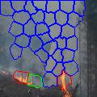
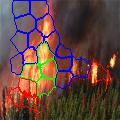
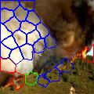
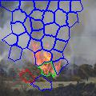
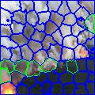
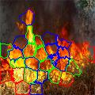
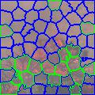

# Fire and Smoke detection

In this work, we trained 2 models, one that involves fire, the other smoke.
Ьodels are the same - you can see it in the code.
In addition, we used superpixel segmentation.

That is, they divided the images into superpixels, which we fed to the model and predicted to see if there was fire or smoke.

As for colors, blue is smoke, red is fire, and green is smoke and fire at the same time.

Here you can see the results with segmentation:

