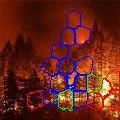

# Fire and Smoke detection
Authors:
[Yana Muliarska](https://github.com/muliarska),
[Nazar Dobrovolskyy](https://github.com/OutJeck)

## Results

In this work, we trained 2 models, one that involves fire, the other smoke.
Obtained results are present in the notebook.

In addition, we used superpixel segmentation.
That is, they divided the images into superpixels, which we fed to the model and predicted to see if there was fire or smoke.

As for colors,  blue is smoke,  red is fire, and  green is smoke and fire at the same time.

Here you can see the results with segmentation:

## Datasets used for classification

### Fire model

[The first dataset](https://github.com/cair/Fire-Detection-Image-Dataset) consists of images of fire and without fire. Here, the images differ in structure, brightness, size, environment, and so on.

[The second dataset](https://data.mendeley.com/datasets/gjmr63rz2r/1) contains 250x250 pixel images. Unnecessary objects have been previously removed from here. According to the description, it is ideal for binary problems like ours. Contains 950 images of each class (fire, no-fire).

To obtain data for training and validation, we combined these two datasets.

### Smoke model

[The dataset](http://smoke.ustc.edu.cn/datasets.htm) with images of smoke. Files are not very high quality to bring our model closer to working in a real environment.

## Structure

1. Data processing and division into parts for training and validation.
2. Initialization of Deep Learning CNN model with different layers.
3. Training model for fire / nonfire classification.
4. Training model for smoke / nonsmoke classification.
5. Metrics are collected during training.
6. Models evaluation based on validation data.
7. Visualization of the classifier results.
8. Images segmentation using the superpixel approach.

